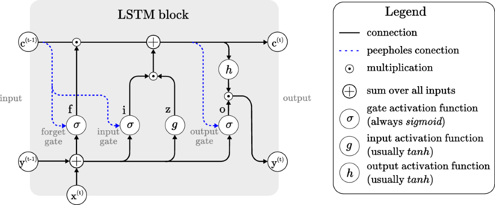

# Learning with Tensors

Random machine learning and deep learning notebooks and implementations.

## Table of contents

- [Machine Learning](#machine-learning)
- [Deep Learning](#deep-learning)
- [References](#references)

## Machine Learning

### Gaussian Process

- [gp](./gp/)

## Deep Learning

### Building a Simple Neural Network

- **Net 1**: A single-layer network that feeds the input layer of size 784 directly into a size 10 output layer.
- **Net 2**: A two-layer network with a single hidden layer of size 12, feeding into the size 10 output layer.
- **Net 3**: A convolutional neural network using local connectivity and [dropout](https://www.cs.toronto.edu/~rsalakhu/papers/srivastava14a.pdf). This network was inspired by LeNet-5 from the paper [Gradient-Based Learning Applied to Document Recognition](http://vision.stanford.edu/cs598_spring07/papers/Lecun98.pdf) by Yann LeCun et al.

**Code**: [torch_nets.py](mnist/torch_nets.py)

### Implementing a Recurrent Neural Network

## References

- [Mathematics for Machine Learning](https://mml-book.github.io/book/mml-book.pdf)
- [An Overview of Gradient Descent Optimization Algorithms](https://arxiv.org/pdf/1609.04747) by Sebastian Ruder
- [Efficient BackProp](https://cseweb.ucsd.edu/classes/wi08/cse253/Handouts/lecun-98b.pdf) by Yann LeCun et al., 1998
