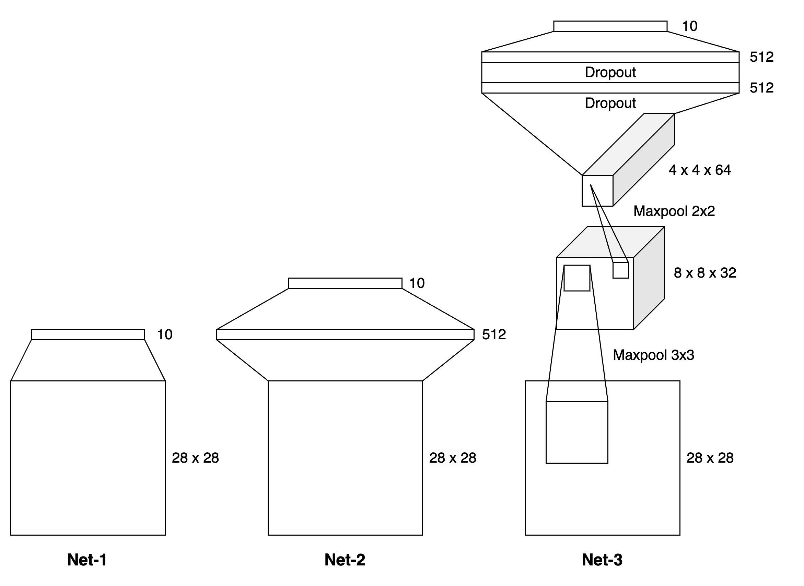

# Learning with Tensors

## The Building Blocks

TODO:

- [ ] Overview of Linear Algebra

- [ ] Gradient Descent and Optimizations

- [ ] Demonstrate regression as a learning task

## Introduction to Deep Learning

### Building a simple Neural Network

Below are 3 simple neural network architectures with implementations in [torch_nets.py](mnist/torch_nets.py). Net 1 depicts a single layer network which feeds the input layer of size 784 into a size 10 output layer. Net 2 depicts a 2-layer network with a single hidden layer of size 12, which feeds into the size 10 output layer. Net 3 depicts a convolutional network with local connectivity between the layers. 

- [ ] RNN - Implementing a simple Recurrent Neural Network 

## Implementing Papers: Vision Models

### Implement AlexNet 

Paper: [ImageNet Classification with Deep Convolutional Neural Networks](https://proceedings.neurips.cc/paper_files/paper/2012/file/c399862d3b9d6b76c8436e924a68c45b-Paper.pdf)

Code: [torch_alexnet.py](alexnet/torch_alexnet.py)

- [ ] ResNet - [Deep Residual Learning for Image Recognition](https://arxiv.org/abs/1512.03385)
